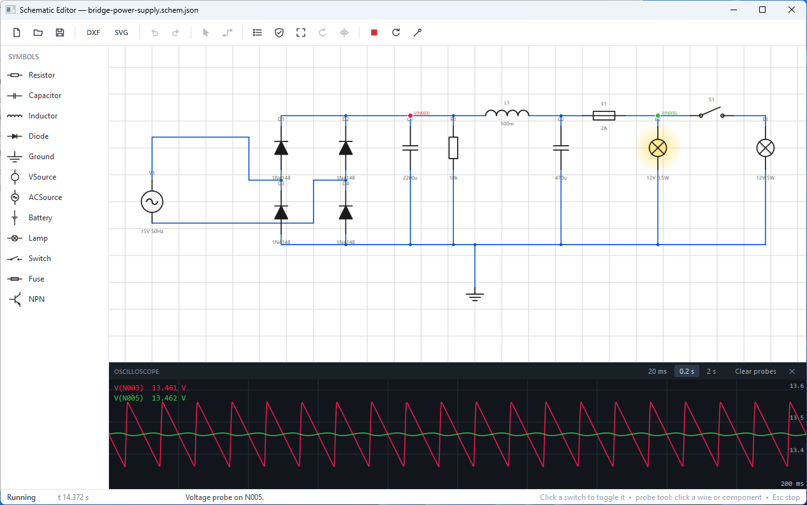

# Schematic Editor

[](https://github.com/sponsors/makarov-mm)
[](LICENSE)


[](https://www.linkedin.com/in/makarov-mm/)
[](https://www.threads.net/@m.m.makarov)
[](https://www.instagram.com/m.m.makarov/)

A minimal electrical schematic editor in C#/WPF with **zero external dependencies** -
no NuGet packages, just .NET 10/C# 14 and hand-written everything: rendering, netlist
extraction, ERC, JSON persistence, DXF and SVG export.



## Features

- **AC analysis (Bode plots)** - SPICE-style small-signal frequency sweep over the
  voltage probes: log-log magnitude and phase from 1 Hz to 100 kHz, one click.
  The same MNA topology is stamped with complex immittances and solved with a
  complex Gaussian elimination - verified against analytic corner frequencies,
  resonance peaks and phase shifts.
- **Live circuit simulation** - real-time transient analysis (MNA + backward Euler)
  running right on the schematic: lamps glow with actual dissipated power, switches
  toggle with a click, fuses blow on overcurrent, and an oscilloscope panel plots
  voltage/current probes you drop onto the circuit. AC sources, capacitors,
  inductors and a piecewise-linear diode are all first-class.
- **Symbol library** - IEC 60617 style symbols (resistor, capacitor, inductor, diode,
  ground, DC source, battery, lamp, switch, fuse, NPN transistor), defined as
  backend-agnostic drawing primitives.
- **Editing** - grid snapping, orthogonal wire routing (L-shaped, dominant axis first),
  rotation in 90° steps, mirroring, rubber-band selection, drag move, copy/paste,
  full undo/redo via the command pattern.
- **No dangling wires by construction** - a wire can only start and end on a symbol pin
  or an existing wire. The cursor magnet-snaps to nearby pins, the preview turns green
  over a legal endpoint, and clicking it finishes the wire in one gesture.
- **Connectivity** - real netlist extraction with union-find: coincident points,
  wire chains and T-connections (a pin or wire end landing on the interior of another
  wire segment) all merge into nets. Junction dots are derived, not drawn by hand.
- **ERC** - unconnected pins, dangling wire ends, single-pin nets, short-circuited
  sources, missing reference designators. Double-click an issue to jump to it.
- **File format** - plain JSON (`.schem.json`), stable and diff-friendly.
- **Export** - hand-written DXF R12 (AC1009) exporter that imports into anything
  from AutoCAD to LibreCAD, plus SVG for documentation.
- **Rendering** - retained document / immediate render on a custom `FrameworkElement`
  (`OnRender` + `DrawingContext`) under a single zoom/pan matrix; crisp at any zoom,
  no per-element visual tree overhead.

## Layout

| Project | Target | Purpose |
|---|---|---|
| `SchematicEditor.Core` | `net11.0` | Document model, commands, netlist, ERC, simulation, JSON/DXF/SVG. No UI types. |
| `SchematicEditor.App` | `net11.0-windows` | WPF editor (canvas, tools, palette, ERC panel). |
| `SchematicEditor.Tests` | `net11.0` | Dependency-free smoke tests (67 checks), including analytic simulation references. |

The core is fully cross-platform and headless; the netlist of a schematic can be
extracted on a Linux CI machine without WPF present.

## Build & run

```bash
# Editor (Windows):
dotnet run --project SchematicEditor.App

# Core tests (any OS):
dotnet run --project SchematicEditor.Tests
```

## Examples

Six ready-made circuits live in [`examples/`](examples/README.md) - an interactive
lamp switch, a fuse that blows, a 1-second RC charge you can watch in real time,
a half-wave rectifier with visible ripple, and more.

## Controls

| Input | Action |
|---|---|
| Palette click | Enter place mode (ghost preview follows cursor; every symbol has an auto-generated icon) |
| `R` / `M` | Rotate / mirror ghost or selection |
| `W` | Wire tool; start on a pin/wire, click a target pin/wire to finish, `Esc`/RMB to cancel |
| Left drag | Move selection / rubber-band select |
| Middle drag or `Space`+drag | Pan |
| Mouse wheel | Zoom at cursor |
| `F` | Zoom to fit |
| `Del`, `Ctrl+Z/Y/C/V/A` | The usual |
| Double-click symbol | Edit refdes / value |
| AC button | Frequency response (Bode magnitude + phase) at the voltage probes |
| Shift+wheel over R/C/L (in run mode) | Step the value along the 1-2.2-4.7 ladder - the running circuit reacts instantly, no reset |
| Click a wire (Select mode) | The whole electrical net lights up - cross-probing |
| ▶ Run | Build the circuit and start the real-time simulation (`Esc` stops) |
| Probe tool | Click a wire/pin -> voltage trace; click a component -> current trace; click a probe to remove it. Works before and during simulation; probes are saved in the file |
| Click a switch (in run mode) | Toggle it live - the lamp reacts immediately |
| ⟳ Reset (in run mode) | Zero time and reactive state, un-blow fuses, clear traces |

Unconnected pins are marked with red circles live, junction dots appear automatically
where three or more connections meet.

## Design notes

- **Connectivity is geometric.** There is no "port" object graph to keep in sync;
  nets are recomputed from coordinates after every change. At schematic scale this
  is effectively instant and eliminates a whole class of stale-connection bugs.
- **Commands own the document.** Every mutation is an `IEditCommand`; the UI never
  touches element lists directly, so undo/redo can't drift out of sync.
- **Palette icons are the symbols.** Each palette icon is rendered at runtime from the
  same drawing primitives the canvas and the exporters use - one source of truth,
  and new library symbols get icons for free.
- **Exports are hand-rolled.** DXF R12 is a simple group-code text format; writing
  ~150 lines by hand beats pulling in a dependency and teaches you what CAD packages
  actually parse. Arcs are flattened to short polylines on export - rotated/mirrored
  true ARC entities are a classic source of import bugs.

**Simulation.** Time-domain Modified Nodal Analysis assembled from the extracted
netlist: all nets containing a `Ground` pin collapse into node 0, voltage sources and
inductors contribute branch-current unknowns, and the dense system is solved with
Gaussian elimination (partial pivoting) every step - at schematic scale that is
microseconds, so clarity wins over cleverness. Capacitors and inductors use
backward-Euler companion models (L-stable, so an ideal source across a closed
switch stays numerically calm), the diode is piecewise-linear (`Von` 0.7 V, `Ron`
50 mΩ) resolved by state iteration inside each step, and a `Gmin` leak on every node
keeps half-connected circuits solvable while you edit. Switches read their live
on/off flag, so toggling one mid-run needs no rebuild - reactive state carries
straight through the click. The simulation clock tracks wall time (50 µs steps,
batched per UI frame); the scope autoscales on a 1-2-5 ladder over the visible
window and decimates to roughly one point per pixel. Values parse with SI suffixes
(`10k`, `100n`, `4.7uF`), lamps as `12V 5W` ratings, AC sources as `5V 50Hz`.
Known limits, on purpose: the NPN symbol is drawable but not simulated, V and A
traces share one vertical scale, and there is no variable time-step control.

**AC analysis.** The frequency-domain solve reuses the transient topology: resistive
elements keep their conductances, capacitors stamp jωC, inductors keep their branch
rows with −jωL, nonlinear elements are linearized around their present state (a
diode contributes 1/Ron or Gmin depending on which segment it currently sits on,
switches contribute their current position). AC sources drive the sweep with their
amplitude; DC sources become shorts, exactly as superposition demands. One complex
Gaussian solve per frequency point, 48 points per decade - a full five-decade sweep
is a few hundred solves of a tiny matrix, i.e. instant.

## Roadmap

- Spatial index (quadtree) for hit-testing on large sheets
- Wire editing (drag segments, split/merge)
- Configurable rules (allow free-floating wires, off-grid placement)
- More symbols, multi-unit symbols, symbol editor
- Net labels and hierarchical sheets
- Print / PDF output

## License

MIT License

Copyright (c) 2026 Mykhailo Makarov

Permission is hereby granted, free of charge, to any person obtaining a copy
of this software and associated documentation files (the "Software"), to deal
in the Software without restriction, including without limitation the rights
to use, copy, modify, merge, publish, distribute, sublicense, and/or sell
copies of the Software, and to permit persons to whom the Software is
furnished to do so, subject to the following conditions:

The above copyright notice and this permission notice shall be included in all
copies or substantial portions of the Software.

THE SOFTWARE IS PROVIDED "AS IS", WITHOUT WARRANTY OF ANY KIND, EXPRESS OR
IMPLIED, INCLUDING BUT NOT LIMITED TO THE WARRANTIES OF MERCHANTABILITY,
FITNESS FOR A PARTICULAR PURPOSE AND NONINFRINGEMENT. IN NO EVENT SHALL THE
AUTHORS OR COPYRIGHT HOLDERS BE LIABLE FOR ANY CLAIM, DAMAGES OR OTHER
LIABILITY, WHETHER IN AN ACTION OF CONTRACT, TORT OR OTHERWISE, ARISING FROM,
OUT OF OR IN CONNECTION WITH THE SOFTWARE OR THE USE OR OTHER DEALINGS IN THE
SOFTWARE.

## Support

If you found this project interesting or useful, you can support my work:

[](https://github.com/sponsors/makarov-mm)
